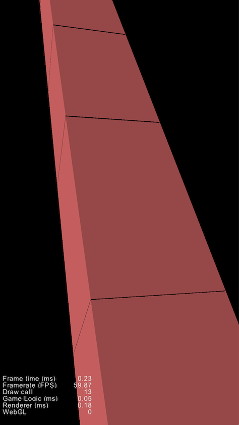

# Example of rendere error in Cocos Creator

Using an Array of cubes and replace theme while camera moves in one direction. 
If the camera have moved 100px the last cube moves to the front and stays in camera view.

There will be visible gab between the cubes,
after the camera moved some distance and replaced the cube multiple times. 

Animation            |  Result  |  small
:-------------------------:|:-------------------------:|:-------------------------:
  |   |  

